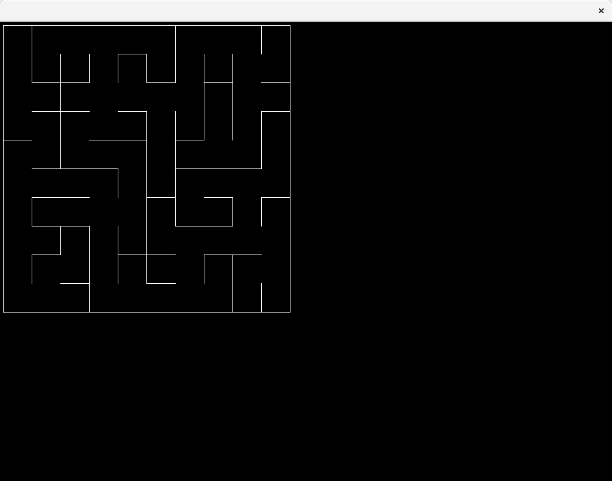

# mazer
Generates solvable mazes using configurable algorithms. Originally completed for COSC1254 Programming Using C++, Semester 2, 2016.

## Building
Depends on SDL2, SDL2-image, SDL2-mixer, SDL2-ttf and SDL2-net. Build with `mkdir build; cd build; cmake ..`.

## Running
Keys:
- 1: Generate maze with Aldous-Broder
- 2: Generate maze with Eller
- q: Solve the maze
- F1: Save binary
- F2: Load binary
- F5: Save SVG

